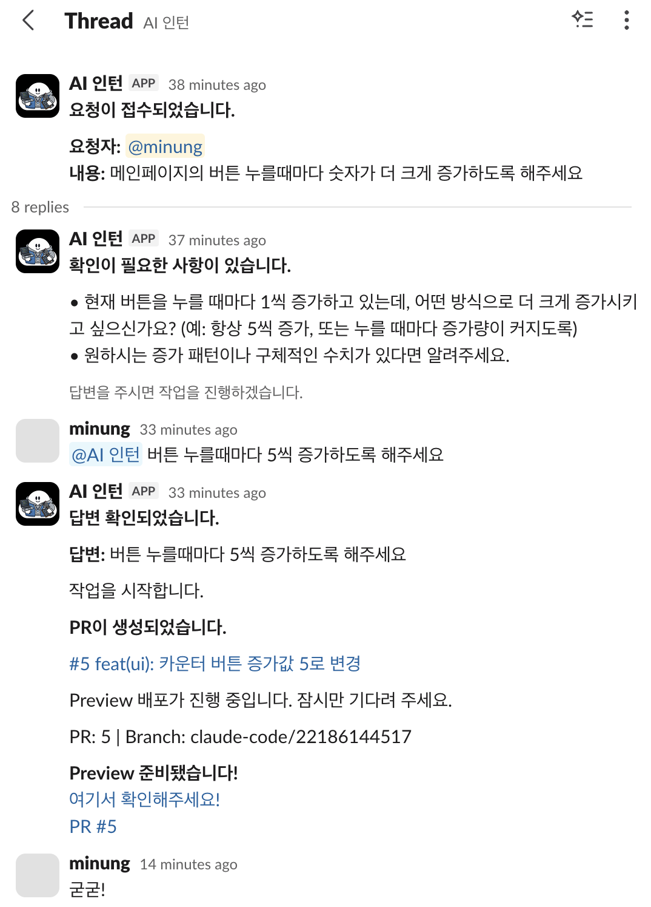

# Ship From Slack

[English](README.md)

작은 코드 변경 요청을 Slack 쓰레드 안에서 정리하고, AI 코딩 에이전트가 Pull Request를 만들고, Preview 링크까지 다시 Slack으로 알려주는 워크플로우입니다.

작은 변경의 병목은 구현이 아니라 커뮤니케이션인 경우가 많습니다.

Ship From Slack은 작고 자주 발생하는 제품/콘텐츠 변경을 처리하는 팀을 위한 도구입니다. 누군가 Slack에서 `/request`로 변경을 요청하면, Slack 앱은 요청을 접수해 GitHub Actions로 전달하고, 코딩 에이전트는 작업에 필요한 맥락이 충분한지 판단한 뒤 타겟 레포의 Pull Request로 만듭니다.



## 무엇을 하나요

- Slack의 `/request` 명령으로 코드 변경 요청을 받습니다.
- 확인 질문, 추가 요청, PR 메타데이터, Preview 링크를 하나의 Slack 쓰레드에 유지합니다.
- `repository_dispatch`로 GitHub Actions를 실행합니다.
- 타겟 레포에서 Claude Agent composite action을 실행합니다.
- 프로덕션에 직접 반영하지 않고 Pull Request를 생성하거나 업데이트합니다.
- 선택적으로 Vercel Preview를 배포하고 결과를 Slack에 다시 알립니다.

## 언제 쓰면 좋나요

Ship From Slack은 카피 수정, FAQ 추가, 간단한 UI 조정, 랜딩 페이지 수정, 기존 PR에 대한 후속 다듬기처럼 작고 리뷰 가능한 변경에 잘 맞습니다.

프로덕션 자동 배포 시스템이 아니며, 코드 리뷰를 대체하지 않습니다. 사전 설계가 필요한 큰 아키텍처 변경에도 적합하지 않습니다.

## 예시 흐름

```text
/request FAQ에 "환불 절차는 어떻게 되나요?" 질문을 추가해줘
  -> Slack 앱이 요청을 GitHub Actions로 전달합니다
  -> 코딩 에이전트가 맥락이 더 필요하면 추가 질문을 합니다
  -> 요청이 충분히 명확해지면 코딩 에이전트가 Pull Request를 엽니다
  -> Preview 링크가 같은 Slack 쓰레드에 올라옵니다
  -> 같은 사람이 같은 쓰레드에서 작은 후속 수정을 요청합니다
```

## 누구에게 도움이 되나요

- 변경을 요청하는 사람은 Slack에서 요청하고, Preview를 확인하고, 원래 쓰레드 안에서 변경을 다듬을 수 있습니다.
- 레포를 관리하는 사람은 반복적인 작은 요청을 범위가 작고 리뷰 가능한 Pull Request로 받을 수 있으며, 논의 맥락도 함께 추적할 수 있습니다.

## 동작 방식

변경을 요청하는 사람 입장에서는 Slack 쓰레드 하나만 따라가면 됩니다.

```text
Slack /request
  -> Vercel에 배포된 Slack 앱
  -> GitHub repository_dispatch
  -> 타겟 레포의 GitHub Actions workflow
  -> Claude Agent composite action
  -> Pull Request
  -> 선택적 Vercel Preview
  -> Slack 쓰레드 업데이트
```

Slack 쓰레드가 워크플로우의 상태 저장소 역할을 합니다. 쓰레드 메타데이터는 요청이 확인 질문을 기다리는 중인지, 작업 중인지, 기존 PR에 추가 요청을 받을 수 있는 상태인지 기록합니다.

## 레포 구조

```text
apps/
  slack-bot/        Vercel serverless Slack 앱
  claude-agent/     변경을 계획, 구현하고 PR을 여는 GitHub composite action
  preview-deploy/   Vercel Preview 배포용 GitHub composite action
docs/
  SETUP.md          영어 설정 가이드
  SETUP.KO.md       한국어 설정 가이드
  ARCHITECTURE.md   기여자용 워크플로우와 상태 모델 문서
```

## 빠른 시작

실제 레포에 설정하려면 먼저 전체 설정 가이드를 읽어보세요.

[docs/SETUP.KO.md](docs/SETUP.KO.md)

설정은 크게 다섯 단계입니다.

1. Slash Command, Interactivity, Event Subscriptions, Bot Token을 포함한 Slack App을 만듭니다.
2. `apps/slack-bot`을 Vercel에 배포합니다.
3. `GITHUB_REPO=owner/repo`로 Slack 앱이 타겟 레포를 바라보게 합니다.
4. 타겟 레포에 `claude-code.yml`과 선택적 `preview.yml` workflow를 추가합니다.
5. 필요한 Slack, GitHub, Anthropic, 선택적 Vercel secret을 추가합니다.

Slack 앱에 필요한 환경 변수:

| 변수 | 용도 |
| --- | --- |
| `SLACK_BOT_TOKEN` | Slack Bot User OAuth Token |
| `SLACK_SIGNING_SECRET` | Slack App Signing Secret |
| `GITHUB_TOKEN` | workflow dispatch가 가능한 GitHub Personal Access Token |
| `GITHUB_REPO` | `owner/repo` 형식의 타겟 레포 |

타겟 레포에 필요한 Secrets:

| Secret | 용도 |
| --- | --- |
| `ANTHROPIC_API_KEY` | Claude Agent API 접근 |
| `SLACK_BOT_TOKEN` | Actions에서 Slack 알림 전송 |
| `PAT_TOKEN` | git push, PR 생성, 라벨 추가, workflow 접근 |

Preview 배포를 사용하려면 `VERCEL_TOKEN`, `VERCEL_ORG_ID`, `VERCEL_PROJECT_ID`도 필요합니다.

## 로컬 개발

워크스페이스 루트에서 의존성을 설치합니다.

```sh
pnpm install
```

Vercel로 Slack bot을 로컬 실행합니다.

```sh
cd apps/slack-bot
cp .env.example .env
pnpm exec vercel dev
```

Claude Agent 타입체크를 실행합니다.

```sh
pnpm --filter claude-agent typecheck
```

## 문서

| 문서 | 용도 |
| --- | --- |
| [Setup Guide](docs/SETUP.md) | 영어 설정 가이드 |
| [Setup Guide (Korean)](docs/SETUP.KO.md) | Slack, Vercel, GitHub Actions, Secrets, 첫 테스트까지의 한국어 설정 가이드 |
| [Architecture](docs/ARCHITECTURE.md) | 요청 상태, payload, 컴포넌트 경계 이해 |
| [Contributing](CONTRIBUTING.md) | 로컬 개발, 기여 흐름, PR 기준 |

## 기여하기

Issue와 Pull Request를 환영합니다. PR을 열기 전에 [CONTRIBUTING.md](CONTRIBUTING.md)를 읽고, 변경 범위를 작게 유지하며, 설정이나 워크플로우 동작이 바뀐다면 문서도 함께 업데이트해 주세요.

## 라이선스

MIT. [LICENSE](LICENSE)를 참고하세요.
